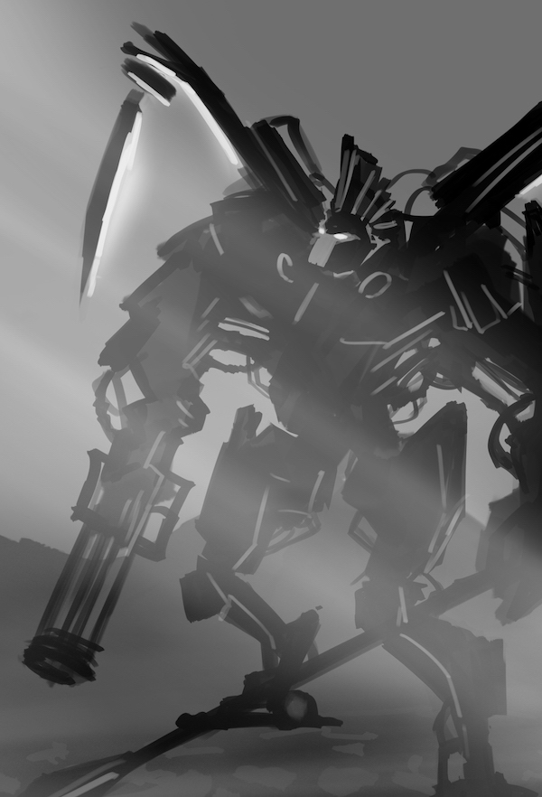

From The Frozen Acheron
==========================================================

This is a repository for the novel I will attempt to create during the [Nanowrimo](http://nanowrimo.org) novel writing November 2017. The idea is to keep the material written in a repository, commiting new work and edits separately, with weekly tagged releases of newly writen "serialized" chapters. 

Using GitHub, it's also very easy to allow people editing the text to fix typos and other mistakes by making pull requests. More about participation in [the collaboration section](sections/Collaboration.md).

Table Of Contents
----------------------------------------------------------

* [Alternative Titles](#alternative-titles)
* [Synopsis](#synopsis)
* [Prologue](sections/Prologue.md)
* [Chapter 00.](chapters/00.md)
* [Acknowledgements](sections/Acknowledgements.md)
* [Collaboration](sections/Collaboration.md)

----------------------------------------------------------

Alternative titles
----------------------------------------------------------

* (Gazing up) From the frozen Styx/Hades/Hell
* 2317 A.D. (Aléxandros Domini)
* The Split in the Sky
* Altermental Earth ⅓  
    * Frozen Earth #1 (2017)
    * Fiery Earth  #2 (2018) 
    * Floating Earth #3 (2019)

----------------------------------------------------------

Synopsis
----------------------------------------------------------

Can a chance encounter change the course of history? How about a single event affecting _multiple histories_? Can our future be shaped by _someone else’s_ past? Can our future be stolen by someone from our past that we never imagined would come back? 

Until the day of the Raptures these were just amusing questions. When the Raptures hit and brought the monsters, the mechanical soldiers of Hell, and after them, the undead heroes we knew only from myth and legend - to the ones witnessing the unimaginable powers of destruction summoned upon our Earth, the answers to those questions became a matter of survival. 

They came after the Sin of their fathers had killed their Sun. Struggling to break from their Hades, they had sucked out the core of their world and left it as a cold dark rock, a graveyard of a planet, orbiting a dark star. Many of them saw the sunlight for the first time in their lives. Many of us died trying to fight their Darkness back to their frozen hellhole. But we never really stood a chance.

Facing the world-eating monstrosities, finding the answers to those questions became the only hope for survival of the Earth.

----------------------------------------------------------

Next > [Prologue](sections/Prologue.md)

----------------------------------------------------------

• (Ɔ) 2017 Saša Tomislav Mataić • All Rights Reversed •

